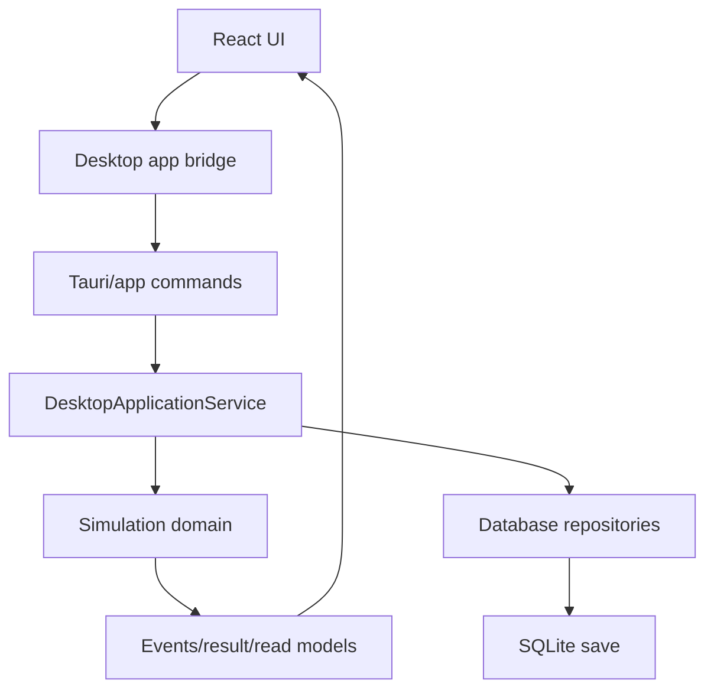

# Desktop Save Integration

Stage 4.1 connects the desktop manager loop to persisted save state through an application-service boundary.

## Current Boundary

Before Stage 4.1, `apps/desktop/src/main.tsx` owned testing players, fixture text, tactic slots, manager state, and quick-sim display in React memory. Tauri exposed no commands. The real save/database/simulation path lived in `packages/database` and `packages/simulation`, but the desktop UI did not use it.

Stage 4.1 introduces:

- `DesktopApplicationService` in `packages/simulation` for save-backed manager commands.
- `apps/desktop/src/appBridge.ts` for the React command client.
- A Playwright-tested browser/dev adapter that persists the same UI flow across reload using local storage.
- Tauri command names in the bridge contract: `list_saves`, `create_career`, `load_save`, `save_tactic`, `quick_sim_match`, and `continue_to_next_fixture`.

React remains a presentation/cache layer. It does not open SQLite, call `node:sqlite`, calculate match outcomes, or mutate save files directly.

## Save Location

The save-backed application service accepts a save directory and creates one SQLite file per save. Desktop production should pass a Tauri application data directory, for example:

`appDataDir()/saves/*.sqlite`

Tests use temporary directories outside the repository. Production saves must not be stored inside the project checkout.

## Adapter Decision

The existing headless database package uses Node's built-in `node:sqlite` adapter. That remains valid for CLI, tests, and headless tooling because the adapter is hidden inside `packages/database`.

Native Tauri desktop should not require a Node runtime. The maintainable production path is a Rust/Tauri SQLite adapter behind the same application command surface, sharing schema/migration semantics and domain command contracts rather than duplicating football business logic in React. Stage 4.1 documents and isolates this adapter boundary; it does not expose `node:sqlite` to the UI.

Until the native adapter lands, the desktop web shell uses the browser/dev bridge for E2E and the Node application service verifies real SQLite persistence in integration tests.

## Command Flow

## Error Handling

Application service commands return structured errors:

- `SAVE_MISSING`
- `SAVE_CORRUPTED`
- `MIGRATION_FAILED`
- `FIXTURE_MISSING`
- `PLAYER_MISSING`
- `INVALID_SELECTION`
- `DATABASE_UNAVAILABLE`
- `SIMULATION_ERROR`

The UI renders these as visible warnings instead of failing to a blank screen.
