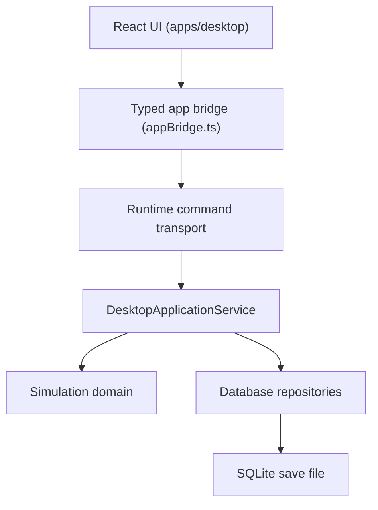

# Desktop Save Integration

The desktop app runs on real SQLite career saves. `DesktopApplicationService` in
`packages/simulation` is the only component that opens save files, initialises worlds, or
advances world state. React is a presentation layer with no game state of its own.

## Runtime Architecture

The engine, the database layer, and every football system are TypeScript/Node. Porting them to
Rust would duplicate the entire simulation, so the desktop runtime keeps the TypeScript service
authoritative and reaches it through a **managed Node sidecar**:

- `packages/simulation/src/desktop-server.ts` exposes the service over a loopback-only HTTP
  command surface. It contains no game logic — each route is a direct service call.
- `desktop-server-cli.ts` is the sidecar entrypoint. It binds `127.0.0.1` on an OS-assigned port,
  generates a per-launch token, and writes a single JSON handshake line to stdout.
- **Tauri** (`src-tauri/src/main.rs`) spawns that sidecar in `setup`, reads the handshake, and
  registers one passthrough command, `runtime_command`. Rust models no game payloads.
- **Vite dev** spawns the same sidecar from a dev-server plugin and proxies `/runtime/*` to it.

Both paths execute identical service code against identical SQLite files. There is no mock mode:
if the runtime is unreachable the UI shows a `RUNTIME_UNAVAILABLE` error rather than falling back
to fabricated state.

## Shared Contract

`packages/shared-types/src/desktop-contract.ts` is the single definition of the desktop wire
format: `DesktopApplicationState`, `SaveCatalogEntry`, `CareerHeader`, `StartingClubOption`,
`SquadRow`, `DesktopErrorCode`, and the `DesktopRuntimeApi` command surface. Both the service and
the UI import it, so the two cannot drift.

## Save Storage

One SQLite file per career, outside the repository:

- macOS — `~/Library/Application Support/NepalFootballSim/saves/<save>.sqlite`
- Windows — `%APPDATA%/NepalFootballSim/saves/`
- Linux — `$XDG_DATA_HOME/nepal-football-sim/saves/`

Under Tauri the directory comes from `app_data_dir()`. `NEPAL_SAVES_DIR` overrides it for tests and
E2E, which use disposable temporary directories.

Each save has a `<save>.meta.json` sidecar holding the catalog entry (`saveId`, `saveName`,
`filePath`, `createdAt`, `updatedAt`, `worldDate`, `characterName`, `activeRole`, `organisation`,
`gameVersion`, `schemaVersion`). The main menu lists saves from these sidecars, so it never opens a
full simulation world. The sidecar is a cache only — it is rebuilt from the save file whenever it
is missing or unreadable, and the `.sqlite` file always wins.

## World Initialisation

Career creation imports the canonical Nepal world through `importNepalWorld`, the same path
`createNepalSave` uses for CLI saves. There is no second world initialiser and no synthetic
testing world in the runtime; the retired Stage 4.1 `seedTestingWorld` has been removed.

Starting clubs are derived from the dataset: any real club whose senior team has at least 14
imported players. Fixtures for the chosen team's competition season are generated on creation if
the season has none, with matchday one a week after the season start so the career opens in
preseason.

## Career Session

The service holds at most one open career at a time: an open `GameDatabase` handle plus the save id
and file path. Opening a career closes any previous one, so two careers can never write to the same
file concurrently and handles cannot leak. `closeCareer` checkpoints the WAL, refreshes the catalog
entry, and releases the handle. Commands issued with no open session return `SESSION_NOT_OPEN`
rather than silently reopening.

`saveCareer` is a real checkpoint, not decoration: it stamps `lastSavedAt`, runs
`PRAGMA wal_checkpoint(TRUNCATE)` so the `.sqlite` file alone is complete, and rewrites the sidecar.

## Command Surface

`listSaves`, `listStartingClubs`, `createCareer`, `loadCareer`, `closeCareer`, `getCareerHeader`,
`getHomeDashboard`, `continueCareer`, `quickSimMatch`, `saveTactic`, `saveCareer`, `deleteSave`.

## Career Creation Transaction

Create file → migrate → `BEGIN` → import Nepal world → schedule fixtures → create person, manager
profile and character → assign starting club contract → default tactic and inbox → `COMMIT`. Any
failure rolls back, closes the handle, and deletes the partial `.sqlite`, `-wal`, `-shm`, and
sidecar files, so a failed creation never leaves an unusable save.

## Error Handling

Commands return structured errors the UI renders as banners, never stack traces: `SAVE_NOT_FOUND`,
`SAVE_CORRUPT`, `MIGRATION_FAILED`, `CAREER_CREATION_FAILED`, `DATABASE_ERROR`, `SESSION_NOT_OPEN`,
`SIMULATION_ERROR`, `FIXTURE_MISSING`, `PLAYER_MISSING`, `INVALID_SELECTION`,
`WORLD_DATA_UNAVAILABLE`, `RUNTIME_UNAVAILABLE`.

## Migrations

Saves use the existing `migrateDatabase` from `packages/database`. Every open runs it, so older
saves upgrade in place. No duplicate migration logic exists in the desktop layer.

## Testing

- `packages/testing/src/stage-four-one-desktop-save.test.ts` drives the service directly against
  real SQLite: real-club/real-player assertions, catalog metadata, reload equivalence, two
  concurrent careers, delete isolation, and database handle cycling.
- `packages/testing/src/desktop-runtime-server.test.ts` covers the sidecar transport, including
  token rejection.
- `apps/desktop/e2e/manager-flow.spec.ts` drives the real UI against the real runtime and asserts
  on save files on disk.

Native Tauri packaging is not covered by automated tests in this environment — see
`decisions.md`.
